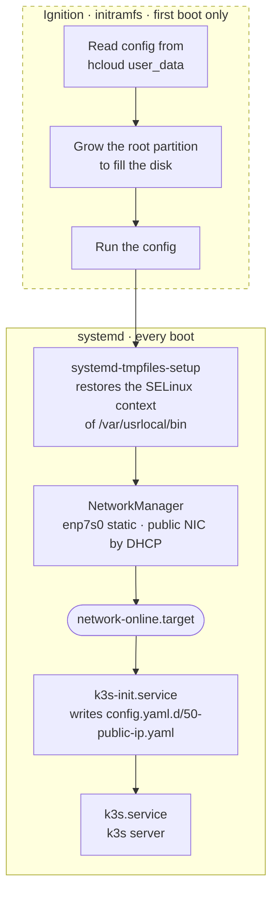

# Boot sequence

That boot sequence is roughly described by the following schema.

The boot sequence of `raya`’s VMs consists in two distinct phases. The first
one only happens during the first boot directly following the provisioning of
the VM: the OS reads the supplied Ignition config (from `user_data`) and runs
it. This is part of [the provisioning of the VM](cluster-provisioning.md).
Then, the regular boot sequence proceeds.

In a nutshell,

1. Using `systemd-tmpfiles`, we label the `k3s` binary provided with the image
   to align it with the [SELinux policy][fcos-selinux] Fedora CoreOS enforces.
   It is written from the Hetzner rescue system, which has no SELinux, so it is
   the one file on the disk that nothing has ever labelled.
2. NetworkManager configures the private interface brought by the `nodes`
   subnet (via `/etc/NetworkManager/system-connections/enp7s0.nmconnection`
   provisioned by Ignition). This configuration step gates the
   `network-online.target` because the NM configuration file explicitely
   specify `may-fail` to true.
3. Once the `network-online.target` is reached, the private interface is
   configured; the public one is up in practice, but nothing guarantees it. We
   then run a one-shot service (`k3s-init`) to complete the configuration of
   the setup by retrieving the public IP and setting it as the external IP of
   the node. We configure the service to retry in case of failure instead of
   modifying the NM configuration for the public interface.
4. Finally, we start k3s.

[fcos-selinux]: https://docs.fedoraproject.org/en-US/fedora-coreos/selinux/
