# Boot sequence

## Shared between the control plane and the agents

The boot sequence of `raya`’s VMs consists in two distinct phases. The first
one only happens during the first boot directly following the provisioning of
the VM: the OS reads the supplied Ignition config (from `user_data`) and runs
it. This is part of [the provisioning of the VM](cluster-provisioning.md).
Then, the regular boot sequence proceeds.

The control plane and the agents share a common prefix for their boot sequence,
namely:

1. Using `systemd-tmpfiles`, we label the `k3s` binary provided with the image
   to align it with the [SELinux policy][fcos-selinux] Fedora CoreOS enforces.
   It is written from the Hetzner rescue system, which has no SELinux, so it is
   the one file on the disk that nothing has ever labelled.
2. NetworkManager configures the private interface brought by the `nodes`
   subnet (via `/etc/NetworkManager/system-connections/enp7s0.nmconnection`
   provisioned by Ignition). This configuration step gates the
   `network-online.target` because the NM configuration file explicitely
   specify `may-fail` to true.
3. Once the `network-online.target` is reached, the private interface is
   configured; the public one is up in practice, but nothing guarantees it. We
   then run a one-shot service (`k3s-init`) to complete the configuration of
   the setup by retrieving the public IP and setting it as the external IP of
   the node. We configure the service to retry in case of failure instead of
   modifying the NM configuration for the public interface.

Additionally, we have introduced a systemd target called `k3s-setup` that is
expected to be used by the control plane and the agents’ units to gate the
launch of the k3s daemon.

[fcos-selinux]: https://docs.fedoraproject.org/en-US/fedora-coreos/selinux/

## Control plane

The control plane boot sequence is summarized in the following diagram.

```mermaid
graph TB
  subgraph terraform["Terraform · after the server is created"]
    attach_nic["Attach the private network interface"]
    attach_vol["Attach the volume"]
  end

  subgraph systemd["systemd · every boot"]
    tmpfiles["systemd-tmpfiles-setup<br/>restores the SELinux context<br/>of /var/usrlocal/bin"]
    nm["NetworkManager<br/>enp7s0 static · public interface by DHCP"]
    online(["network-online.target"])
    init["k3s-init.service<br/>writes config.yaml.d/50-public-ip.yaml"]
    mkfs["mkfs-k3s-volume.service<br/>creates a filesystem<br/>if the device has none"]
    mount["var-lib-rancher-k3s.mount<br/>/var/lib/rancher/k3s"]
    seed["k3s-seed-pki.service<br/>reconciles the data directory<br/>with the Ignition config"]
    manifests["k3s-sync-manifests.service<br/>links the Ignition manifests<br/>into the auto-deploy directory"]
    setup(["k3s-setup.target"])
    k3s["k3s.service<br/>k3s server"]

    nm --> online --> init
    mkfs --> mount --> seed --> manifests

    tmpfiles --> setup
    online --> setup
    init --> setup
    mount --> setup
    seed --> setup
    manifests --> setup
    setup --> k3s
  end

  attach_nic -.->|enp7s0 appears| nm
  attach_vol -.->|device appears| mkfs

  classDef shared stroke:#3f7fbf,stroke-width:2px
  classDef control stroke:#bf7f3f,stroke-width:2px

  class attach_nic,tmpfiles,nm,online,init,setup shared
  class attach_vol,mkfs,mount,seed,manifests,k3s control
```

While agents are stateless, the control plane VM carries the cluster datastore
and its KPI. In order for them to survive a VM replacement, they are moved to
an external volume. When the volume is first created, it is bare and needs to
be formatted. Once it is node, it also needs to be mounted, and alone then can
`k3s` be started (if they other members of the `k3s-setup` target are ready as
well, obviously).

The control plane detects a stalled volume by comparing its provisioned secrets
(namely, its secret token and its CA) with the one currently saved on the
mounted volume. If they disagree, the previous cluster datastore and PKI are
dropped completely.

The manifests carried by the Ignition config are symlinked into `k3s`’
auto-deploy directory on the volume, so that `k3s` applies them as it starts.
As they are links and not copies, a manifest removed from the config will leave
an broken symlink. Such link is deleted on the next boot, and `k3s` tears down
what it had deployed.

`k3s` deploys a few components of its own the same way. `raya` turns one of
them off: `local-storage` is toggled to `disable`[^rationale] via the control plane
configuration. As a consequence, the [Hetzner CSI driver](kube-system.md) is
the only storage provider on the cluster.

[^rationale]: A disabled component is uninstalled by `k3s`. The configuration
    applies to a pre-existing cluster, on the boot that follows the change. In
    our case, changing the configuration means replacing the VM anyway.
