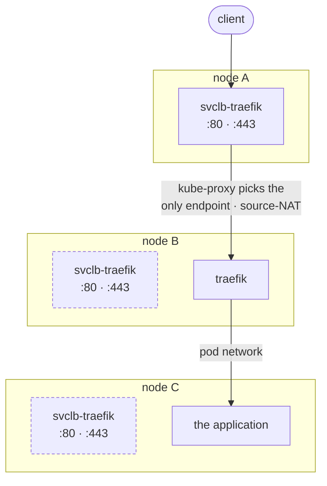
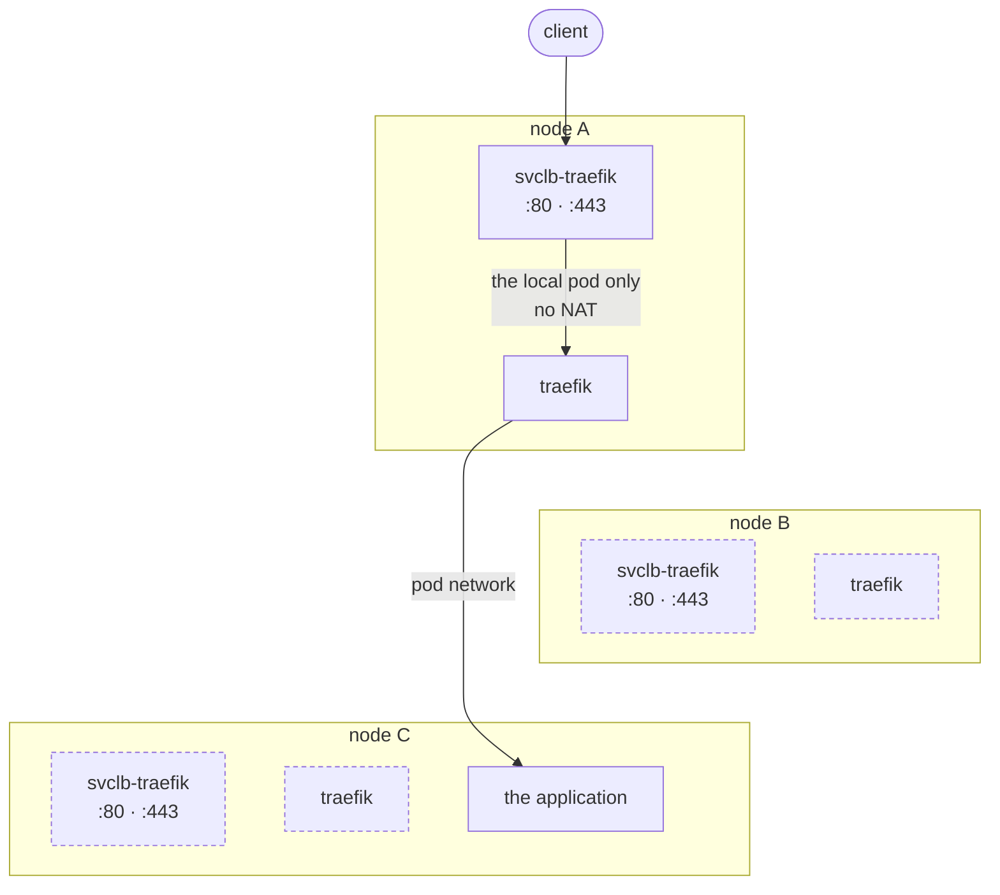

# The kube-system namespace

`k3s` ships a handful of components of its own in `kube-system`, and installs
most of them from bundled Helm charts (see [the boot sequence](boot.md)).

This page describes what the resulting cluster offers to the charts deployed on
top of it.

## Traefik, the ingress controller

Applications deployed on `raya` are expected to declare `traefik` as their
`ingressClassName`.

By default, `k3s` deploys Traefik as a single-replica `Deployment`. In such a
setup, a request received by node A is redirected to node B (to reach Traefik)
then to node C (to reach the application).



With such a topology, replacing the node running Traefik results in a
cluster-wide outage until it is rescheduled, which can take several minutes if
Traefik happened to run on the control plane (since the API is down, nothing can
reschedule it).

`k3s` installs Traefik from a `HelmChart` of its own, which `raya` has no
reason to fork. Instead, we deploy a `HelmChartConfig` sharing the same name.
It is used to overwrite the default configuration of `k3s` deployment.

`raya` runs Traefik as a `DaemonSet` instead, and configures the Traefik service
with `externalTrafficPolicy: Local`, meaning a node only ever hands a request to
its own Traefik pod, never to another node’s. Every node terminates ingress
traffic itself.



As a by-product, since the request is not source-NAT’ed on its way in, Traefik
sees the client’s own address. That is what makes the `X-Forwarded-For` header it
sets trustworthy, and IP allowlisting or per-address rate limiting possible at
all.

Finally, the `websecure` entrypoint (`:443`) has TLS enabled at the chart level,
so an `Ingress` only has to name the `Secret` holding its certificate; there is
nothing to configure on the entrypoint itself.

## external-dns, the name publisher

`external-dns` automates the lifecycle of records necessary for an application
deployed on `raya` to be reached via its declared domain. The DNS zones
`external-dns` can manage are defined in `local.dns_zones`.

By default, `external-dns` writes the address reported by the Ingress’ load
balancer. In our case, since Traefik is a `DaemonSet`, `external-dns` creates
one record per node making up `raya`. DNS sends a client to any node, and every
node can terminate.

Google Cloud DNS is one of the providers external-dns speaks natively. It
authenticates as a service account holding `dns.admin` on a project that holds
nothing but our zones. Records are owned rather than merely written.
`external-dns` keeps a TXT record next to each one, stamped with this cluster’s
name, and runs with `--policy=sync`: a name that stops being claimed is deleted
again, and one that was never ours is left alone.

## cert-manager, the certificate issuer

Traefik's `websecure` entrypoint serves whatever certificate the `Ingress` of
an application names. `cert-manager` is the component reaching out to the
certificates issuer (in our case, `letsencrypt`) when new ones are required
(new application, renewal, etc.). 

The shape of an `Ingress` asking for a certificate becomes quite
straightforward:

```yaml
metadata:
  annotations:
    cert-manager.io/cluster-issuer: letsencrypt
spec:
  tls:
    - hosts: [h.ry.xmu.mx]
      secretName: hello-tls
```

`cert-manager` watches for that pair, issues the certificate, and writes it into
the named `Secret`. Traefik then picks it up. The `hello` application deployed
on the cluster does exactly this, and is what tells us the whole chain works.

The issuer is configures to solve ACME challenges over `DNS-01` rather than the
default `HTTP-01`. `DNS-01` is the only challenge that can carry a wildcard
which one of our application needs. Google Cloud DNS is a solver `cert-manager`
implements natively. It authenticates as its own service account with
`dns.admin` granted.

### Checking propagation against public resolvers

`cert-manager` will not tell Let's Encrypt a challenge is ready until it has seen
the record itself, and by default it asks the zone's authoritative nameservers.
With some cloud providers, this can be be an issue as such requests can be
routed to a local instance whose view of the zone lags behind the public one.
In that case, the check fails with `NXDOMAIN` on a record that resolves fine
from outside.

`raya` therefore runs `cert-manager` with `--dns01-recursive-nameservers-only`
and `--dns01-recursive-nameservers` pointed at `1.1.1.1` and `8.8.8.8`[^vultr].
The propagation check is answered by the same kind of resolver Let's Encrypt
will use.

[^vultr]: This was the case for Vultr. It's not clear if Hetzner would suffer
    the same issue, but relying on public DNS worked in the past so there is
    little reasons to change this.

## The Hetzner CSI driver, the storage provider

An application that needs to keep a persistent state accross pod reschedules
asks for it with a `PersistentVolumeClaim`. The Hetzner CSI driver is
configured to provision a Hetzner volume and attaching it to the node the pod
runs on, so the state outlives both the pod and the machine.

!!! warning
    A pod holding a volume can move between nodes in one location, never
    between locations. As a consequence, we plan to only get agents in the same
    region as the control plane (`hel1` at the time of writing).

A pod dying, or its node being replaced, detaches and re-attaches the volume.
Only deleting the `PersistentVolumeClaim` (*e.g.*, by destroying the pod)
destroys the Hetzner volume. The deletion is driven from the cluster, losing
the datastore does not delete the volumes: it orphans them instead. They remain
provisioned, albeit unattached, and they are still billed.

The controller authenticates with a token of its own, held in the `hcloud`
`Secret`. It is distinct from the one Terraform runs on, even if the two tokens
actually share the same rights (Hetzner does not provide a fine-grained
capabilities system for its API token).

## Flux, the delivery solution

The control plane API endpoint is only reachable from within the cluster, via
its private interface. This means our only opportunity to _push_ something to
the cluster is at provision time via the Ignition config of the control plane.

To deploy workloads, we use [Flux] to _pull_ specs instead from git
repositories. Flux is configured in two steps. A “bootstrap” is embedded in the
Ignition config. This bootstraps declares a `GitRepository` resource for
`raya`’s own upstream, and a `Kustomization` telling Flux to watch the
`deploy/` directory.

As a consequence, any (transitive) changes to `deploy/kustomization.yaml` will
trigger Flux to sync the cluster accordingly.

Only the two controllers a git-to-cluster reconciliation needs are installed,
`source-controller` and `kustomize-controller`. Helm releases keep coming from
`k3s`’ own controller, as every chart above does.

!!! note

    The chart ships four more controllers, which `raya` turns off.

    - `helm-controller` reconciles `HelmRelease` resources. It is what deploying
      applications packaged as Helm charts would need.
    - `image-reflector-controller` and `image-automation-controller` watch a
      registry for new tags and commit the update back to git. That would
      streamline remaining up-to-date.
    - `notification-controller` sends events outwards and receives webhooks,
      which lets a push trigger a sync rather than waiting for the interval to
      come round.

[Flux]: https://fluxcd.io/

## The fleet, declared once

Flux carries `deploy/fleet/agents.json` into the cluster as a `ConfigMap` via a
`configMapGenerator`.

Every ten minutes, `deploy/fleet/node-reaper.yaml` compares the fleet the file
declares against the `agent-N` nodes that exist, and deletes the `NotFound`
node that should not exist anymore. This is a lot more convenient than trying
to garbage collect discarded nodes when we downscale the cluster.

!!! note
    Its filters node names to onyl keep `agent-<n>` objects, meaning the
    control plane is not addressable by it.
