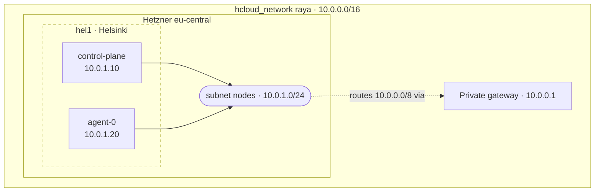

# Networking

## Firewall

Every VM making up `raya` is attached to the same `hcloud_firewall`, declared
in `network.tf`. It only defines inbound rules, all from `0.0.0.0/0`.

| Port | Why |
| ---- | --- |
| `22` | The only way into a node, and the only way to the control plane API — which is [reached through an SSH tunnel](administrating.md). |
| `80` | Traefik’s `web` entrypoint. |
| `443` | Traefik’s `websecure` entrypoint. |
| ICMP | `ping`, which [the status page](status-page.md) relies on. |

Ports `80` and `443` are open on *every* node, control plane included, because
Traefik runs as a `DaemonSet` behind ServiceLB (see [the `kube-system`
namespace](kube-system.md)).

!!! note

    A Hetzner Cloud firewall only filters the public interface. Traffic inside
    the `nodes` subnet is never subject to it, which is why the k3s API (`6443`)
    needs no rule.

Additionally, every VM making up `raya` also configures its local firewall to
prevent pods running on them to access Hetzner metadata server
(`169.254.169.254`). Reaching the metadata server could allow a malicious pod
running on the control plane VM the secrets embedded in its Ignition file.

## Private Network

VMs making up `raya` talk to each other via a dedicated private network which
is declared in `network.tf`. The VMs are all attached to the same subnet
located in the `eu-central` zone, meaning server locations are restricted to
`hel1` (Helsinki), `nbg1` (Nuremberg), and `fsn1` (Falkenstein).

Traffic inside a subnet is not billed by Hetzner, and it means node-to-node
communication stays off the public Internet.

## Addressing

Addresses inside `nodes` are assigned by hand in `network.tf`, so they follow a
convention rather than a mechanism. `10.0.1.1` to `10.0.1.9` are reserved for
Hetzner and use cases that may arise at a later date. The control plane takes
`10.0.1.10`, and agents start at `10.0.1.20`.

## Topology

The current topology is as follows[^location]:

[^location]:  Location clusters are shown to highlight the impact of one of
    Hetzner’s locations going down, they do not represent any kind of
    partitioning inside the `nodes` subnet)
