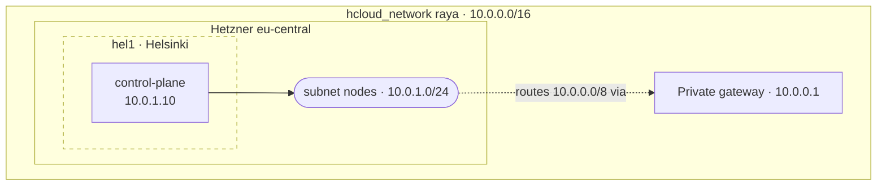

# Private network

VMs making up `raya` talk to each other via a dedicated private network which
is declared in `network.tf`. The VMs are all attached to the same subnet
located in the `eu-central` zone, meaning server locations are restricted to
`hel1` (Helsinki), `nbg1` (Nuremberg), and `fsn1` (Falkenstein).

Traffic inside a subnet is not billed by Hetzner, and it means node-to-node
communication stays off the public Internet.

## Addressing

Addresses inside `nodes` are assigned by hand in `network.tf`, so they follow a
convention rather than a mechanism. `10.0.1.1` to `10.0.1.9` are reserved for
Hetzner and use cases that may arise at a later date. The control plane takes
`10.0.1.10`, and agents start at `10.0.1.20`.

## Topology

The current topology is as follows (location clusters are shown to highlight
the impact of one of Hetzner’s locations going down, they do not represent any
kind of partitioning inside the `nodes` subnet):

