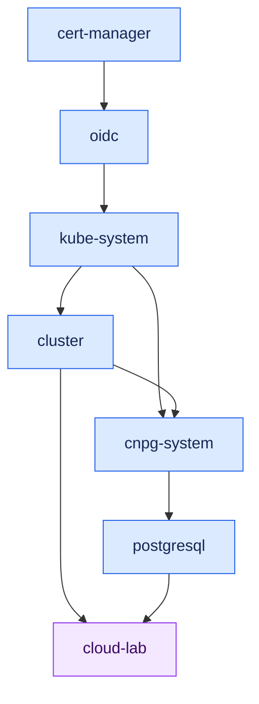

# Provisioning strategies

`k3s` ships a handful of components of its own in `kube-system`, and installs
most of them from bundled Helm charts. `raya` builds on top of that, tweaking
the behavior of some charts or installing others. This is achieved by two
distinct mechanisms:

- The auto-deploy mechanism of `k3s`, as detailed in the [boot
  procedure](boot.md). Modifying these services requires replacing the control
  plane.
- Flux reconciliation. `raya` is configured to track the content of the
  `deploy/` directory.

Because replacing the control plane is disruptive, any services which can
be deployed via a Flux kustomization relies on that mechanism. The remaining
ones cannot for various reasons, and end-up being provisioned via Ignition.

Independently of how they end up being deployed on `raya`, this page describes
the provided services.

The following diagram explicits the Kustomization deployed on this cluster, as
well as their respective dependencies.

